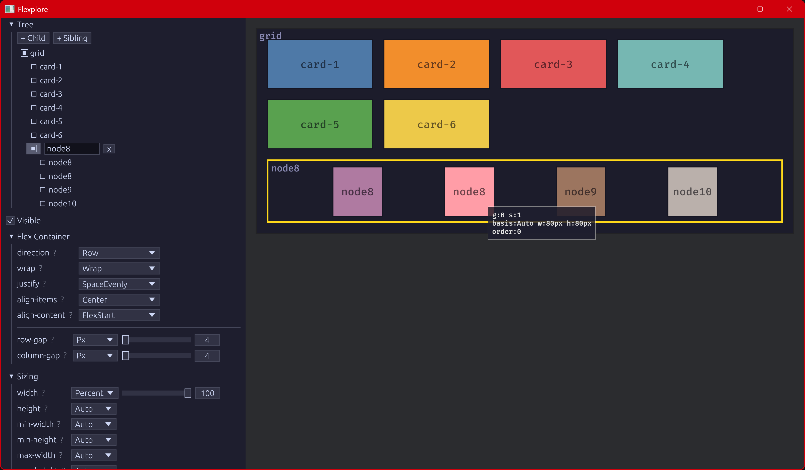

# Flexplore

Interactive flexbox layout explorer. Build node trees, tweak every flexbox property, and see the results instantly. Export equivalent code in six frameworks.

## Features

- **Real-time visual preview** — see layout changes as you adjust properties
- **Hover preview** — preview property changes before committing
- **Click-to-select** — click nodes in the visualization to select them
- **Full flexbox controls** — direction, wrap, justify, align, gap, grow, shrink, basis, order
- **Sizing controls** — width, height, min/max, padding, margin
- **Visibility toggle** — hide nodes to see how layout reflows
- **Code export** — copy equivalent code in Bevy, HTML/CSS, Tailwind, React, SwiftUI, or Flutter
- **Undo/redo** — Ctrl+Z / Ctrl+Y with full snapshot history
- **Save/load** — auto-saves your session; export and import layouts as JSON
- **Preset templates** — Holy Grail, Sidebar + Content, Card Grid, Nav Bar
- **Generative art backgrounds** — expression trees, Voronoi, flow fields, crackle, op art
- **Dark/Light theme**

## Keyboard Shortcuts

| Action | Shortcut |
|---|---|
| Undo | Ctrl+Z |
| Redo | Ctrl+Y / Ctrl+Shift+Z |
| Add child | Ctrl+Enter |
| Add sibling | Shift+Enter |
| Delete node | Delete |
| Select parent | Escape |
| Next sibling | Down |
| Previous sibling | Up |
