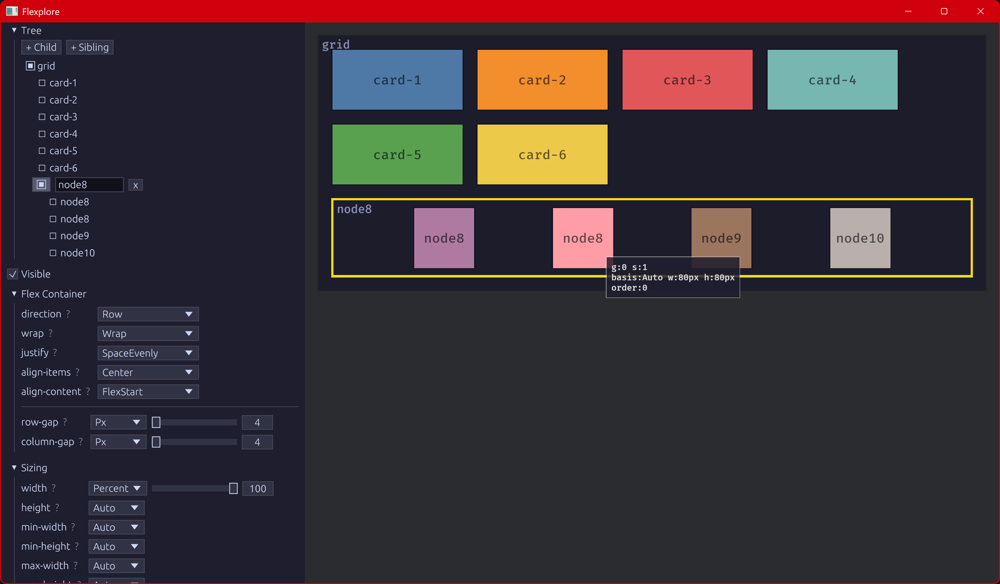

# Flexplore

Interactive flexbox layout explorer. Build node trees, tweak every flexbox property, and see the results instantly. Export equivalent code in many frameworks.



## Features

- **Real-time visual preview** — see layout changes as you adjust properties
- **Hover preview** — preview property changes before committing
- **Click-to-select** — click nodes in the visualization to select them
- **Full flexbox controls** — direction, wrap, justify, align, gap, grow, shrink, basis, order
- **CSS Grid** — grid templates, auto-flow, and item placement (column/row spans)
- **Sizing controls** — width, height, min/max, padding, margin
- **Visibility toggle** — hide nodes while keeping their space (`visibility: hidden`)
- **Code export** — copy equivalent code in Bevy, HTML/CSS, Tailwind, React, SwiftUI, Flutter, Iced, egui, React Native, or Dioxus
- **Undo/redo** — Ctrl+Z / Ctrl+Y with full snapshot history
- **Save/load** — auto-saves your session; export and import layouts as JSON
- **Preset templates** — Holy Grail, Sidebar + Content, Card Grid, Nav Bar, grid dashboards and galleries
- **Generative art backgrounds** — expression trees, Voronoi, flow fields, crackle, op art
- **Multiplayer** — share a room link and edit the same layout live over WebRTC (peer cursors and selections included)
- **Catppuccin themes** — Latte, Frappé, Macchiato, Mocha

## Building and running

```sh
cargo run                      # native desktop app (joins a fresh multiplayer room)
cargo run -- my-room           # join a named room
trunk serve                    # web build at http://127.0.0.1:8080 (install: cargo install trunk)
cargo test --workspace         # codegen snapshot tests live in flexplore-core
cargo run -p update-snapshots  # regenerate testdata/*/expected.* after changing a generator
```

The golden screenshots in `testdata/` (one PNG per fixture and backend, plus
`testdata/overview.html`) are rendered by `cargo run -p build-overview`; CI
re-renders and commits them on every change to the generators or fixtures.

## Keyboard Shortcuts

| Action           | Shortcut              |
| ---------------- | --------------------- |
| Undo             | Ctrl+Z                |
| Redo             | Ctrl+Y / Ctrl+Shift+Z |
| Add child        | Ctrl+Enter            |
| Add sibling      | Shift+Enter           |
| Delete node      | Delete                |
| Select parent    | Escape                |
| Next sibling     | Down                  |
| Previous sibling | Up                    |
